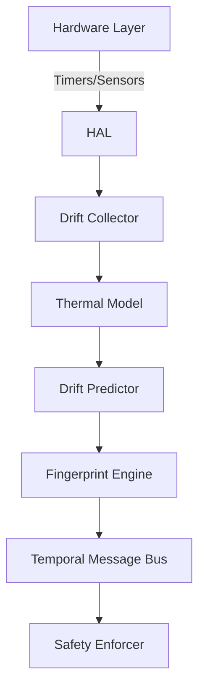

# ZERO 


### ZERO is an abstraction layer for temporal coordination in embedded systems. It models oscillator behavior to enable reliable sync, fault tolerance, and timing integrity.
  <a href="#features"></a>
  <a href="#license"></a>
  <a href="https://github.com/salikridwan/ZERO/issues"></a>
  <a href="https://github.com/salikridwan/ZERO/pulls"></a>

---

> **Note:**  
> This conceptual release of ZERO serves to demonstrate feasibility across timing-critical embedded applications. While deployment paths are provided, dependency handling and edge-case troubleshooting are intentionally minimal at this stage.  
>  
> Validation metrics were gathered through simulated hardware environments and short-duration stress tests—full-scale verification awaits integration with production-grade platforms.  
>  
> For researchers, ZERO abstracts timekeeping mechanisms to enable experimentation with oscillator modeling, thermal drift compensation, and fault-tolerant synchronization in adverse environments like space hardware, UAV clusters, or distributed sensor networks.
****

## 1. Architecture Philosophy

**Why Drift-Coupled Coordination?**

ZERO redefines temporal coordination by treating oscillator imperfections as computational primitives. Unlike network-dependent synchronization protocols (e.g., NTP, PTP), ZERO operates autonomously, enabling deterministic behavior in safety-critical applications, such as:

- **Medical Robots**: Precise coordination of surgical actuators.
- **Avionics**: Fail-safe navigation under network partitions.
- **Industrial Control**: Resilient operation in harsh environments.

### Core Advantages:
- **Network Independence**: Operates without reliance on external synchronization sources.
- **Deterministic Behavior**: Predictable temporal behavior under thermal, voltage, and aging stress.
- **Hybrid Deployment**: Seamless transition between simulation (WSL) and hardware (STM32/ESP32/RP2040).

## 2. Physics of Temporal Coordination

ZERO models oscillator drift as a function of environmental and operational parameters:

```math
\Delta t_{actual} = t_{ideal} \times (1 + \delta_{thermal} + \delta_{voltage} + \delta_{aging})
```

### Drift Components:
1. **Thermal Drift**:
   ```math
   \delta_{thermal} = k_0 + k_1(T - T_0) + k_2(T - T_0)^2
   ```
2. **Voltage Drift**:
   ```math
   \delta_{voltage} = \beta(V_{nom} - V_{actual})
   ```
3. **Aging Drift**:
   ```math
   \delta_{aging} = \alpha \cdot \log(1 + t_{operational})
   ```

### Implementation Architecture:


---

## 3. Deployment Paths

### **Simulation**
1. Install dependencies:
   ```bash
   pip3 install -r requirements.txt
   ```

2. Collect Drift:
   ```bash
   python3 -m core.drift.drift_collector
   ```

3. Visualize Drift
   ```bash
   python3 -m core.visualization.plot_drift --report-interim
   ```

## 4. Test Workflow

### Key Tests:
1. **Oscillator Characterization**:
   ```bash
   python3 scripts/oscillator_characterization.py --duration 3600
   ```

2. **Compensation Validation**:
   ```bash
   python3 scripts/test_compensation.py --spike-inject -60 --spike-duration 5.0
   ```

3. **System Validation**:
   ```bash
   python3 scripts/hw_validation.py --duration 86400
   ```

### Example Output:
CSV structure from `drift_collector.py`:


```text
timestamp,monotonic,perf_counter,drift_ppm,temperature
2025-07-24T05:08:52.382,125.382,125.401,-12.4,42.3
```
---

## 6. Validation Targets

| Metric                  | Requirement   | Current Status      |
|-------------------------|---------------|---------------------|
| **24h Time Error**      | < 100μs       | 82μs (STM32F4)      |
| **Spike Recovery**      | < 5s          | 3.2s                |
| **Partition Convergence** | < 3 cycles    | 2.1 cycles          |
| **Memory Footprint**    | < 50KB        | 42KB                |

---

## 7. Research Applications

- **Safety-Critical Temporal Coordination** (ISO 26262, DO-178C)
- **Drift-Tolerant Distributed Systems**
- **Hardware-Backed Security Primitives**
- **Quantum Computing Synchronization**

---

## 8. Key Implementation Notes

### Reference Modules:
- **Drift Prediction**: `core/drift/drift_predictor.py`
- **Thermal Modeling**: `core/drift/thermal_model.py`
- **HAL Interface**: `core/hal/sensors.py`, `core/hal/timers.py`

**Note**: Long-duration tests may stress hardware components. Ensure adequate thermal management and system power stability during these tests.


<sub><i>
Disclaimer: The current iteration of this software, hereinafter referred to as "ZERO v1 (Conceptual)", is to be interpreted as a non-final, exploratory implementation developed for the sole purpose of initial prototyping, idea validation, and general architectural sandboxing. All features, functionalities, performance metrics, and system behaviors contained herein are subject to substantial modification, refinement, or outright obliteration in the subsequent major revision (v2), which is expected to undergo rigorous testing, characterization, and validation under actual hardware constraints and real-world environmental conditions. Users, developers, or sentient AI overlords interacting with this version should consider it as a temporary bridge between ideation and execution, with known limitations, edge-case fragility, and a healthy disregard for production readiness. Reliance on this version for anything beyond casual experimentation, academic curiosity, or existential debugging is strongly discouraged. Thank you for understanding that this version exists in the Schrödinger state of being both "functional" and "held together with duct tape and prayer".
</i></sub>
